# Введение
Данный репозиторий представляет код для управления роботом Kuka YouBot и осуществления его навигации с помощью камеры и ArUco маркеров.
Для запуска кода необходимо иметь калибровочные параметры видео камеры. Изображения для калибровки можно сделать с помощью [get_video_screens.py](https://github.com/konstNova/youbot_get_aruco/blob/main/get_video_screens.py). Калибровочные коэффициенты рассчитываются в [camera_calibration.py](https://github.com/konstNova/youbot_get_aruco/blob/main/camera_calibration.py). При наличии калибровочных параметров основной код запускается из [robot_control.py](https://github.com/konstNova/youbot_get_aruco/blob/main/robot_control.py). Для корректной работы в файлах нужно изменить пути до папок, подробнее описано ниже.

# Преобразование координат
Для успешной навигации по камере в первую очередь необходимо понимать, как происходить преобразование координат реального мира в координаты относительно камеры. В официальной документации OpenCV [^1] [^2] есть объяснения на эту тему. Если кратко, то необходимо преобразовать координаты объекта из системы мировых координат в систему координат относительно камеры, затем можно преобразовать 3D координаты относительно камеры в 2D координаты на изображении, получаемом с камеры (Рисунок 1).

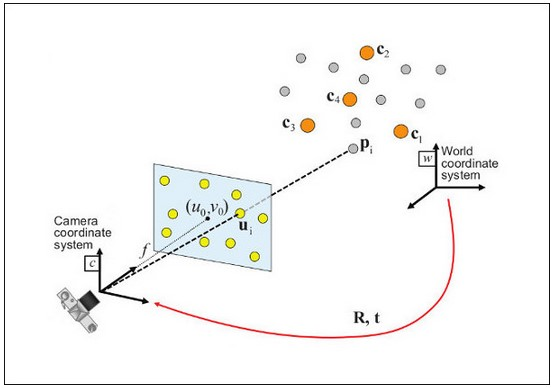

Рисунок 1 – Положение объектов в разных системах координат

Преобразование из мировых 3D координат в 3D координаты относительно камеры производятся с помощью уравнения на рисунке 2, где в левой части координаты в системе камеры, а справа матрица преобразования и координаты в мировой системе. 

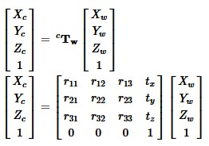

Рисунок 2 – Переход из мировых координат в систему координат камеры

Для матрицы преобразования нужны коэффициенты ротации (rvec) и смещения (tvec), обозначенные на рисунке 2 как rij и ti. Значения коэффициентов будут зависеть от текущего положения камеры и оцениваемого объекта. Их получение описано в следующем пункте.
Для того, чтобы определить координаты объекта на изображении, нужно перейти из 3D координат в системе камеры к 2D координатам изображения. Это происходит через уравнение, представленное на рисунке 3. Таким образом, рассчитанные выше значения необходимо домножить на диагональную матрицу и матрицу камеры. Матрица камеры содержит коэффициенты фокусных расстояний f и оптических центров с. Набор коэффициентов будет постоянным для одной и той же камеры с постоянными настройками по типу фокусного расстояния и т.д. Получить их можно при калибровке камеры, которая заключается в оценке коэффициентов матрицы камеры по изображению с известным паттерном (шахматная доска). Для более точной калибровки необходимо несколько изображений паттерна под разными углами.

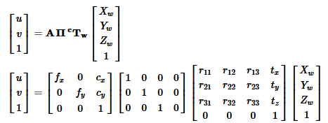

Рисунок 3 – Переход из 3D системы координат относительно камеры в 2D координаты на изображении

Для получения изображений для калибровки камеры используется скрипт get_video_screens.py. При подключенной камере должно появиться окно с текущим видеопотоком. При нажатии клавиши пробел текущий кадр сохранится в папку с адресом, записанным в переменной folder_path (Листинг 1). Для завершения программы нужно нажать клавишу Esc. Пример изображений представлен на рисунке 4.

Листинг 1 – Сохранение калибровочных изображений
```
1.	    elif k%256 == 32:
2.	        # SPACE pressed
3.	        folder_path = "/home/adminuser/Рабочий стол/Novoselov/video_screens/"
4.	        img_name = SCREEN_NAME + "_{}.png".format(img_counter)
5.	        cv.imwrite(folder_path+img_name, frame)
6.	        print("{} written!".format(img_name))
7.	        img_counter += 1

```
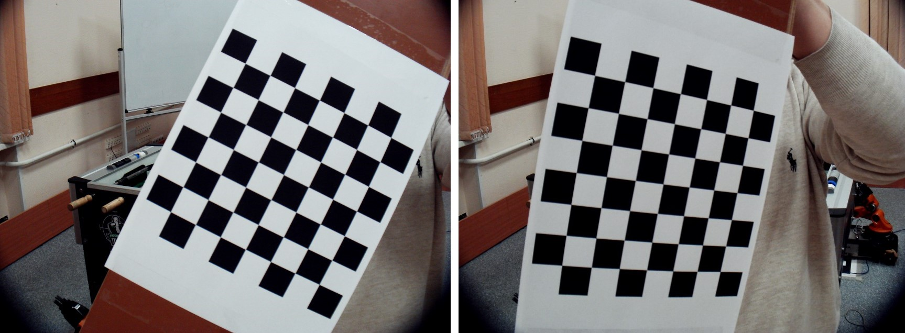

Рисунок 4 – Пример изображений для калибровки камеры

Далее полученные изображения используются для калибровки камеры в скрипте camera_calibration.py. Здесь в функцию glob.glob() необходимо передать адрес подгружаемых изображений, и в конце скрипта, в блоке сохранения рассчитанных коэффициентов, внести в переменную path путь папки, в которую они будут сохранены в сериализованном виде с помощью библиотеки pickle (Листинг 2).

Листинг 2 – Пути до файлов при калибровке камеры
```
  # Извлечение пути отдельного изображения, хранящегося в данном каталоге
images = glob.glob('/home/adminuser/Рабочий стол/Novoselov/screens_for_calibration/*.png')

# Сохранение калибровочных параметров в файл
save_list = [mtx, dist, rvecs, tvecs]
name_list = ['mtx', 'dist', 'rvecs', 'tvecs']
path = '/home/adminuser/Рабочий стол/Novoselov/camera_calibration_data/'
for i in range(len(name_list)):
    with open(path+f'{name_list[i]}.pickle', 'wb') as handle:
        pickle.dump(save_list[i], handle)

```

# Оценка положения маркеров
В скрипте aruko_pose_estimation.py расположены функции для оценки положения маркеров, расчета и перевода необходимых координат. Вначале необходимо загрузить калибровочные параметры камеры, изменив путь в переменной path (Листинг 3).

Листинг 3 – Выгрузка коэффициентов камеры
```
1.	# Загрузка параметров калибровки камеры
2.	mtx, dist, rvecs, tvecs = np.zeros(1),np.zeros(1),np.zeros(1),np.zeros(1)
3.	camera_param = [mtx, dist, rvecs, tvecs]
4.	name_list = ['mtx', 'dist', 'rvecs', 'tvecs']
5.	path = '/home/adminuser/Рабочий стол/Novoselov/camera_calibration_data/'
6.	for i in range(len(name_list)):
7.	    with open(path+f'{name_list[i]}.pickle', 'rb') as handle:
8.	        camera_param[i] = pickle.load(handle)
```

Далее приведем краткий обзор представленных в файле функций. Функция def aruco_detection(image) принимает на вход кадр из видеопотока и визуализирует на нем распознанные аруко маркеры (рисует точку в центре, рамку вокруг и пишет ID маркера сверху) (Рисунок 5).

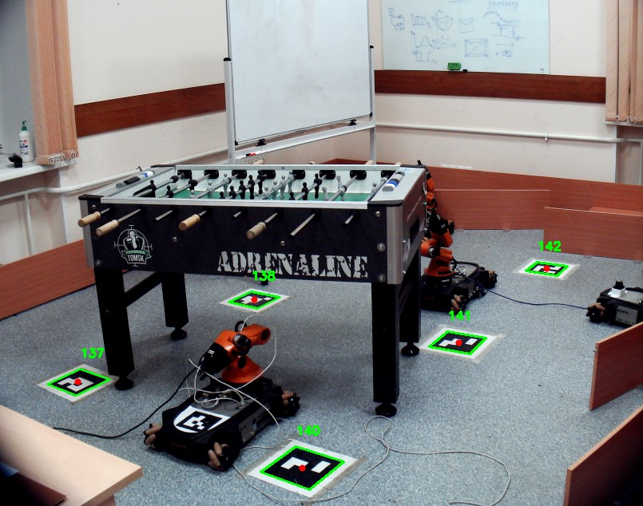

Рисунок 5 – Пример работы функции aruco_detection

Функция  def draw_Aruco_marker_ID(image, markerCorner, markerID) только рисует ID маркера на изображении, но в отличие от предыдущей функции принимает на вход кадр видеопотока вместе с координатами угла и ID маркера.
Функция def pose_estimation(frame, matrix_coefficients, distortion_coefficients, base_id, target_id) основная в данном файле. Принимает на вход кадр видеопотока, коэффициенты матрицы, коэффициенты искажений, ID маркера на роботе и ID маркера, к которому нужно двигаться. Внутри функции также детектируются маркеры на изображении, затем в цикле код проходится по каждому обнаруженному маркеру и выделяет их рамкой, а для целевого и базового маркера еще сохраняются коэффициенты rvec и tvec, необходимые для перевода координат из мировых в систему камеры. После расчета коэффициентов определяется целевой вектор (path_vector). Идея заключается в том, что мы определяем коэффициенты rvec и tvec для каждого маркера, исходя из того, что каждый из них в отдельности является центром своей мировой системы координат (так заложено в OpenCV). Используя уравнение на рисунке 2, с помощью rvec и tvec мы переводим каждый маркер в систему координат камеры. Но робот действует в собственной системе координат, которую мы можем привязать к системе координат базового аруко маркера, находящегося на роботе. Зная rvec и tvec базового маркера и координаты целевого маркера в системе камеры, мы можем перевести координаты целевого маркера в систему координат относительно базового маркера (робота) с помощью обратной матрицы преобразования базового маркера. Другими словами, мы имеем уравнение, представленное на рисунке 2, или записанное в краткой форме как: 
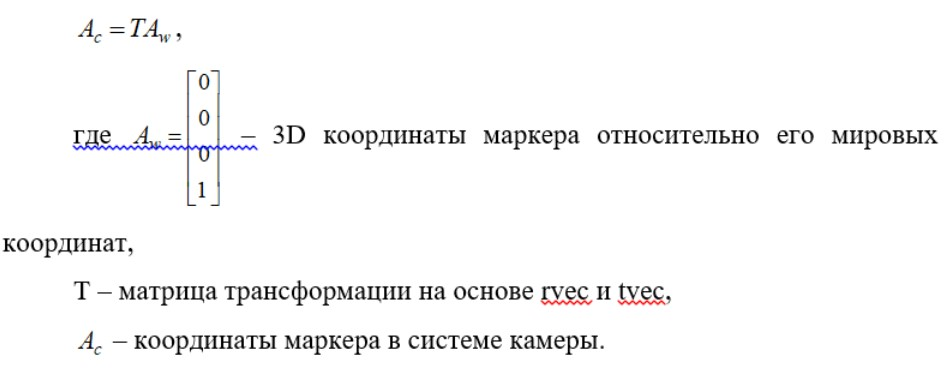
Используя для координат целевого вектора матрицу   с rvec и tvec для базового маркера, мы можем получить координаты    целевого маркера в мировых координатах базового вектора (эти координаты будут равны координатам вектора, поскольку координаты базового вектора в его системе координат равны 0):
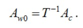

Именно такой вектор получается на выходе функции def get_path_vector(base_rvec, base_tvec, target_coors_camera_3d).  
Функция def make_trans_mat(rvec, tvec) возвращает матрицу трансформации T на основе переданных в функцию rvec и tvec.
Функция def get_marker_coors(rvec, tvec) реализует расчет координат по уравнениям на рисунках 2-3 и возвращает координаты маркера в виде 3D координат в системе камеры и 2D координат на изображении.

# Управление роботом
В работе используется мобильный робот Kuka youbot, управляемый с помощью ROS. Конечная реализация программы с движением робота к указанному маркеру представлена в скрипте robot_control.py. В функции main создается нода ‘pubListener’ (Рисунок 6), которая передает управляющие команды в соответствующий топик. Также при отключении python интерпретатора вызывается функция myhook(), останавливающая робота.
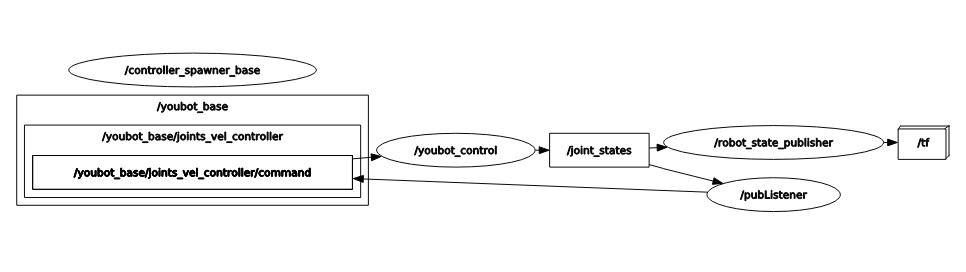

Рисунок 6 – Нода pubListener, публикующая в топик робота

Для использования необходимо запустить скрипт robot_control.py, далее программа попросит ввести ID целевого аруко маркера. После ввода робот начнет движение, при этом на экране все распознанные маркеры будут иметь пространственные оси, но на целевом и базовом маркере они отображаться не будут (Рисунок 7).
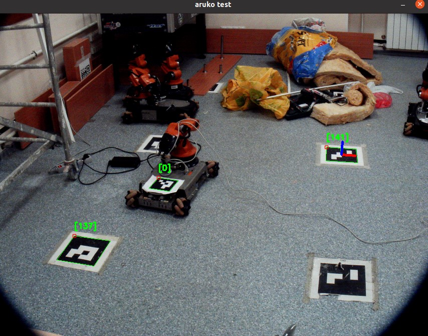

Рисунок 7 – Движение робота к целевому маркеру

Стоит отметить, что код реализован так, что чем дальше робот от цели, тем быстрее он к ней движется. По достижении цели в консоль выведется сообщение “ROBOT FINISHED” и снова появится запрос на целевой маркер (Рисунок 8). Робот финиширует, когда до цели остается меньше 0.25 м (параметр DIST в консоли).
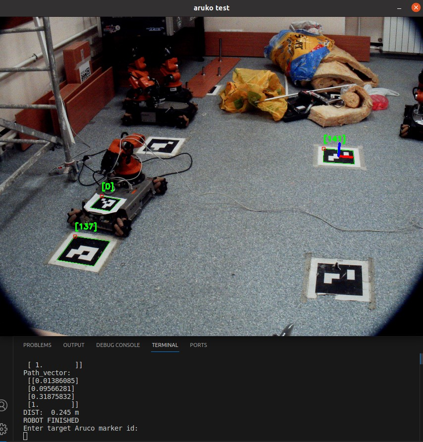

Рисунок 8 – Финиш робота

Если робот не успеет доехать до цели и маркер аруко будет чем-либо перекрыт, робот также остановится и появится сообщение "No target. Robot stopped", оси на маркерах пропадут (рисунок 9). Если преграду убрать, то путь робота продолжится, но иногда он сам становится преградой. Также по ходу движения робота можно остановить нажатием клавиши R и задать другой целевой маркер (рисунок 10). Появится сообщение "Target reload. Robot stopped" и запрос нового ID целевого вектора.
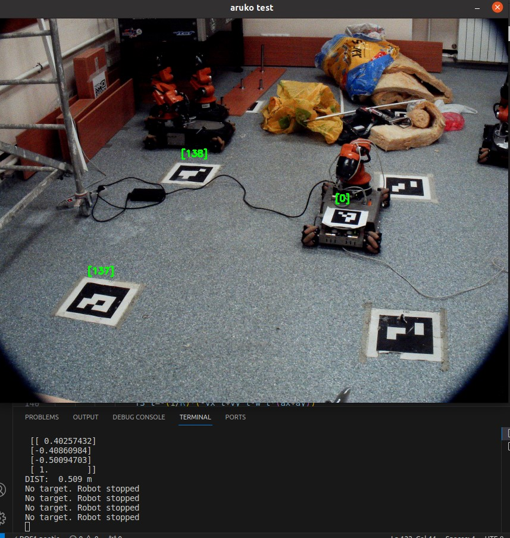

Рисунок 9 – Остановка робота из-за препятствия

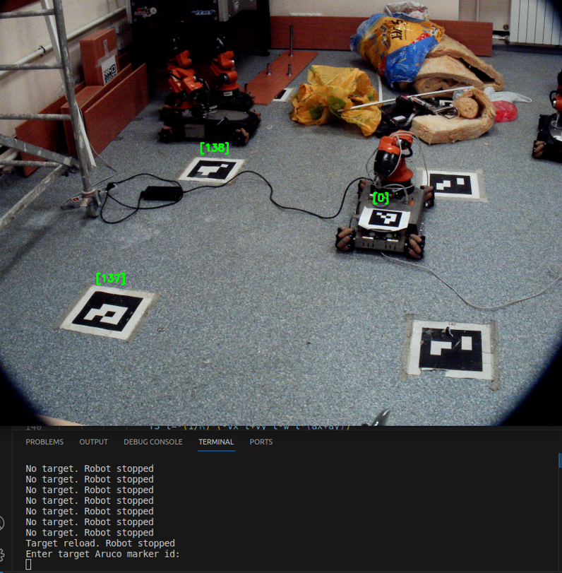

Рисунок 10 – Смена целевого маркера

Скорости колес робота рассчитываются по уравнениям обратной кинематики для Kuka youbot и заданным в начале скрипта параметрам: радиус колес R=0.05 м, координата положения колеса по оси Х ax=0.15 м и координата положения колеса по оси У aу=0.33 м (листинг 4).
Листинг 4 – Расчет обратной кинематики робота
```
1.	vx_t = 0.1*path_vector[0]   
2.	vy_t = 0.1*-path_vector[1]    
3.	f1_t=-(1/R)*(vx_t+vy_t-w_t*(ax+ay))
4.	f2_t=(1/R)*(-vx_t+vy_t+w_t*(ax+ay))
5.	f3_t=-(1/R)*(-vx_t+vy_t-w_t*(ax+ay))
6.	f4_t=(1/R)*(vx_t+vy_t+w_t*(ax+ay))
```

[^1]: [Принципы оценки координат с использованием камеры](https://docs.opencv.org/4.x/d5/d1f/calib3d_solvePnP.html)
[^2]: [Калибровка камеры OpenCV](https://docs.opencv.org/4.x/dc/dbb/tutorial_py_calibration.html)
